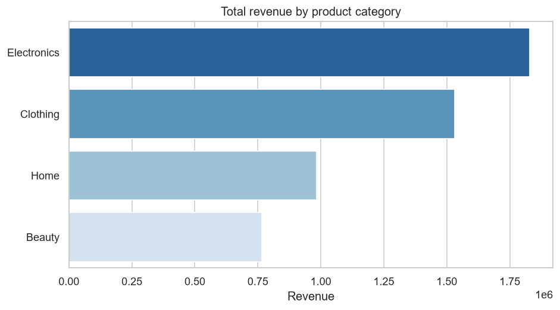
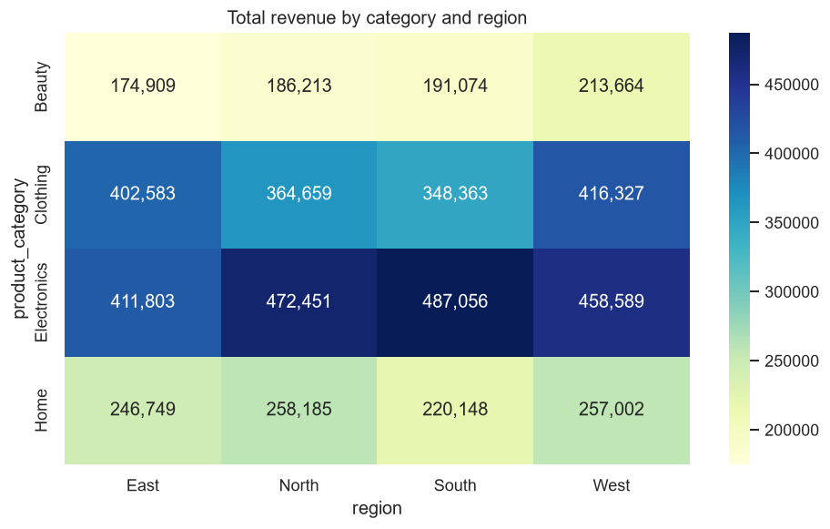
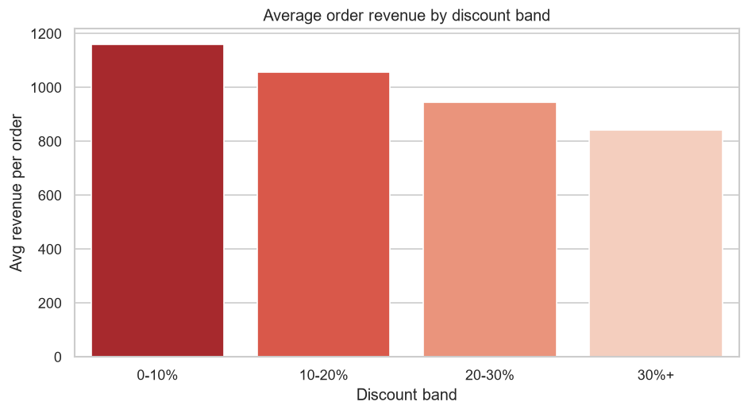
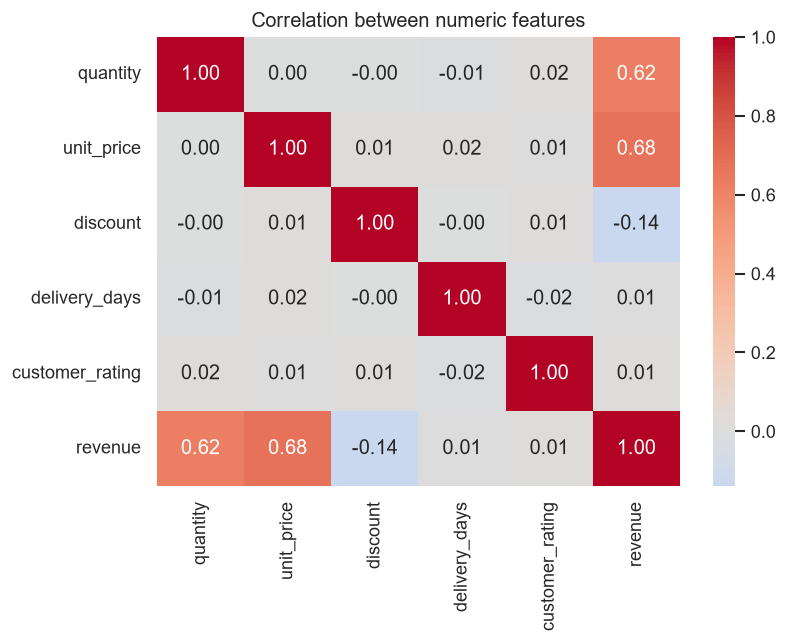
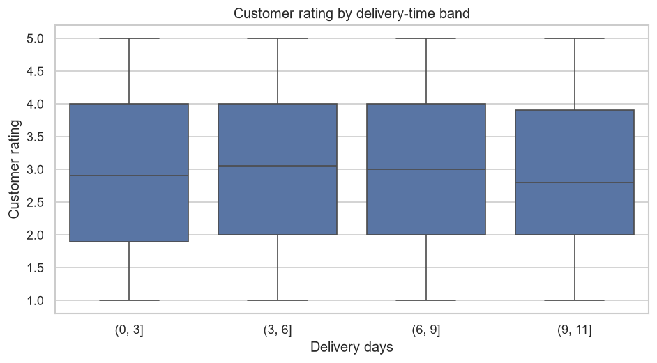
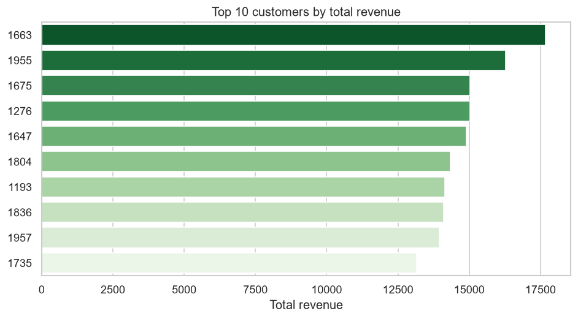
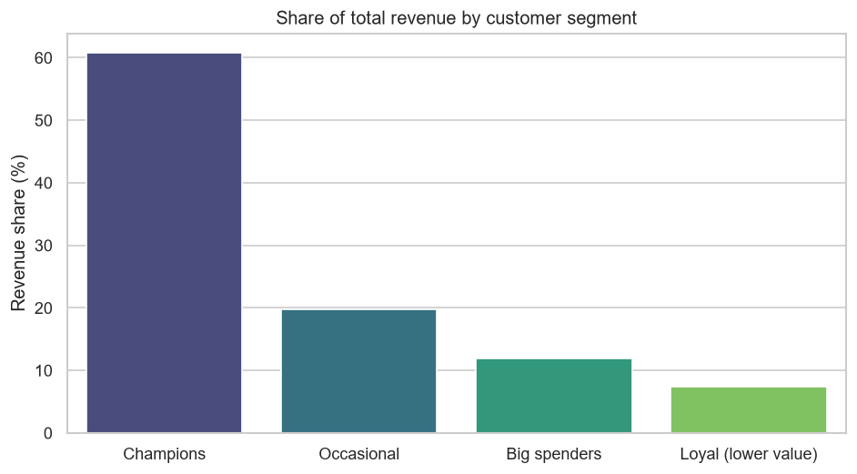

# E-Commerce Sales Performance Analysis

Analysis of an e-commerce sales dataset (5,000 orders) using Python (pandas +
Jupyter), exploring what drives revenue, where it comes from, and who the best
customers are. Environment and packages are managed with [uv](https://docs.astral.sh/uv/).

## Executive summary

Across 5,000 orders from 989 customers (~5.1M total revenue), revenue is driven by
**price and volume, not discounting or geography**. A small core of high-value
customers carries the business, and discounts actively shrink order value.

**Top recommendations:**

1. **Cap discounting.** Average order value falls from ~1,160 (≤10% off) to ~840
   (30%+ off) with no volume payoff — replace blanket discounts with targeted offers.
2. **Protect and grow the "Champions."** ~40% of customers generate **61% of revenue**;
   invest in loyalty, early access, and referrals to retain them.
3. **Lead with category mix, not regions.** Electronics + Clothing drive ~two-thirds of
   revenue while the four regions are near-identical — prioritise product strategy.
4. **Look past delivery speed for satisfaction.** Ratings are flat regardless of delivery
   time (r ≈ −0.02); focus on product quality, expectations, and support instead.
5. **Fix the order-date field** before any forecasting — dates currently run to 2035.

## Highlights

- **Revenue is price- and volume-led** — it equals `quantity × unit_price × (1 − discount)`
  exactly, and correlates most with unit price (0.68) and quantity (0.62).
- **Discounting erodes order value** — average revenue per order falls from ~1,160
  at low discounts to ~840 above 30%.
- **Electronics and Clothing dominate revenue**; revenue is evenly spread across regions.
- **Delivery speed doesn't move customer ratings** (r ≈ −0.02).
- **Data-quality catch** — order dates run to 2035 and need validation before any
  time-series work.

See the notebooks for the full analysis:
- [`notebooks/01_exploratory_analysis.ipynb`](notebooks/01_exploratory_analysis.ipynb) — data quality + EDA
- [`notebooks/02_sales_analysis.ipynb`](notebooks/02_sales_analysis.ipynb) — deeper analysis, conclusions & recommendations
- [`notebooks/03_customer_segmentation.ipynb`](notebooks/03_customer_segmentation.ipynb) — FM scoring + K-Means customer segments

## Visual analysis

All figures are generated reproducibly by [`scripts/generate_figures.py`](scripts/generate_figures.py)
(`uv run python scripts/generate_figures.py`).

### Revenue by product category



**What it shows:** total revenue contributed by each product category.
**Context:** Electronics (~1.83M) and Clothing (~1.53M) together generate roughly
two-thirds of all revenue, while Home and Beauty trail. Category mix — not
geography — is the main lever for growing top-line revenue.

### Revenue by category and region



**What it shows:** a heatmap of revenue for every category × region combination.
**Context:** the four regions are strikingly balanced (each ~1.24M–1.35M total), so
no single region is under- or over-performing. The variation that matters lives in
the categories (rows), reinforcing that product strategy beats regional strategy here.

### Average order revenue by discount band



**What it shows:** the average revenue of an order within each discount band.
**Context:** average order value falls monotonically from ~1,160 at ≤10% discount to
~840 above 30%. Deeper discounts systematically shrink order value without a
compensating volume boost — a strong argument for **capping discounts and testing
targeted promotions** instead of blanket price cuts.

### Correlation between numeric features



**What it shows:** pairwise correlations among the numeric fields.
**Context:** revenue is driven almost entirely by **unit price (0.68)** and
**quantity (0.62)**, with discount pulling the other way (−0.14). Delivery days and
customer rating are essentially uncorrelated with everything — including each other —
which sets up the next chart.

### Customer rating by delivery-time band



**What it shows:** the distribution of customer ratings across delivery-time buckets.
**Context:** ratings sit near 3.0 regardless of whether delivery took 1–3 days or 9+
(correlation ≈ −0.02). **Faster delivery does not buy higher satisfaction** in this
dataset, so satisfaction efforts should look elsewhere (product quality, expectation
setting, support) rather than logistics speed.

### Top 10 customers by revenue



**What it shows:** the ten customers contributing the most total revenue.
**Context:** the top customers sit within a fairly narrow band, so revenue isn't
dependent on a handful of whales — but this list is the natural starting point for
retention, loyalty, and VIP-segmentation follow-ups.

### Revenue share by customer segment



**What it shows:** each Frequency–Monetary segment's share of total revenue
(see [`notebooks/03_customer_segmentation.ipynb`](notebooks/03_customer_segmentation.ipynb)).
**Context:** **Champions** (≈40% of customers) generate **~61% of all revenue**, while
the "Occasional" segment — a similar headcount — contributes under 20%. Revenue is
highly concentrated in the best customers, so retention of Champions and upselling of
Big spenders matter more than broad acquisition. This is the strongest lever in the
whole analysis.

## Setup

Install [uv](https://docs.astral.sh/uv/getting-started/installation/), then:

```powershell
uv sync          # creates .venv and installs all dependencies from uv.lock
```

That's it — `uv sync` builds the environment, installs the `dataanalyst`
package (so it's importable in notebooks/tests), and pins everything via
`uv.lock` for reproducible installs.

## Structure

```
data/
  raw/         # original, immutable inputs (git-ignored)
  processed/   # cleaned / derived data (git-ignored)
  external/    # third-party source data (git-ignored)
notebooks/     # Jupyter notebooks, numbered by stage (01_, 02_, ...)
src/dataanalyst/  # reusable code (paths, data IO, analysis helpers)
reports/
  figures/     # exported charts (git-ignored)
tests/         # pytest tests
```

## Data

The dataset is pulled programmatically from Kaggle — no manual download needed.

1. Create a Kaggle API token (Kaggle → *Settings* → *API* → **Create New Token**)
   and save the downloaded `kaggle.json` to `~/.kaggle/kaggle.json`.
2. Fetch the data into `data/raw/`:

   ```python
   from dataanalyst.data import fetch_dataset
   fetch_dataset()   # downloads via kagglehub, skips files already present
   ```

Data files live under `data/` and are git-ignored — only the folder structure is tracked.

## Usage

Start JupyterLab and open `notebooks/01_exploratory_analysis.ipynb`:

```powershell
uv run jupyter lab
```

Load data in a notebook or script:

```python
from dataanalyst.data import load_raw, save_processed

df = load_raw("E-Commerce Sales Analytics.csv")
save_processed(df_clean, "ecommerce_clean.parquet")
```

## Common commands

```powershell
uv sync                  # install / update the environment
uv add <package>         # add a runtime dependency
uv add --dev <package>   # add a dev dependency
uv run pytest            # run tests
uv run ruff check .      # lint
uv run jupyter lab       # launch notebooks
```
